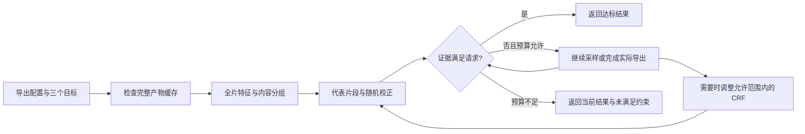

# 三轴控制与证据契约

## 请求、调度和结果

把目标写为 `compute=(T, N, E)`、`reliability=(ε, 1−δ)`、`size=(Bmax, CRFmax)`。其中 T 是分析截止时间，N 是新增片段试编码上限，E 是累计请求编码量。ε 定义为 `abs(predicted−actual)/actual`。这三个目标共同约束同一个调度过程。



完整产物缓存命中时可以直接跳过特征与抽样阶段。每个子进程共享同一单调时钟截止时间；超时会终止整个子进程组，并清理临时文件。操作系统调度和清理仍可能造成少量超时，不能承诺硬实时。

预测事件是当前所选配置的结果，可能随新证据变大或变小；增加算力不保证单个案例的点误差单调下降。API 不应向用户伪造这样的单调性。应检验总体预算—误差曲线，以及明确的约束达标率。

## 估计器

1. 按样本时长划分全片。提取输入包大小，以及经过允许的输出滤镜后的低分辨率纹理、时间变化特征。
2. 用最多三个内容组的代表片段形成固定代理模型。每段使用真正的 x264 导出配置编码。
3. 从其余片段中按固定种子随机排列，抽取审计样本，修正代理残差。

设 P 为代表片段，U 为其余 N 段，A 是从 U 中不放回均匀抽取的 n 段；y 是实际试编码 payload，m 是由代表片段确定的预测，则

```text
estimated_payload = sum(y[P]) + sum(m[U]) + N * mean(y[A] − m[A])
```

代表片段确定后，代理模型保持固定。固定 n 下，随机残差项使总量估计对**独立片段编码 payload 总量**无偏。测试枚举审计子集验证这一性质。该结论不等于对连续完整文件无偏：GOP、lookahead、音频边界和封装开销仍有系统误差，且根据观测结果停止后不能照搬固定 n 的方差结论。

全片特征是一次解码扫描，不是常数时间操作。低分辨率分析降低后续计算量，无法省去源解码。现实现会缓冲预览帧和包元数据，大型视频的内存与预处理成本尚需优化。

## 可靠性轴

证据只有三种：

| `uncertainty.kind` | 含义 | 是否可以宣称请求达标 |
| --- | --- | --- |
| `uncalibrated` | 有点估计，抽样离散度未覆盖编码上下文及封装偏差 | 否 |
| `split_conformal` | 独立来源校准得到的边际覆盖区间 | 区间宽度满足 ε，且没有待验证硬体积上限时可以 |
| `exact` | 同一导出配置的完整文件已经生成且摘要通过校验 | 可以，前提是字节数也满足体积上限 |

`coverage` 指来自声明校准域的新来源的**边际覆盖率**，不是对任意单个视频的无条件概率保证。来源分布改变时不能继承结论。

校准分数为 `abs(log(predicted/actual))`。校准域、FFmpeg 版本指纹、线程数、编码配置、采样策略、种子及样本前缀必须匹配。对 Q 个允许的 CRF，在第 j 个采样前缀分配 `δ / (Q·j·(j+1))` 的失效概率，所有前缀与设置的总和不超过 δ。这样覆盖自适应停止和缓存产生的更多前缀，且不依赖新视频有多少片段。样本数不足时拒绝生成有限区间。单次固定观察下，95% 覆盖至少需要 19 个独立来源；逐步观察需要更多，且得到有限区间仍不代表区间足够窄。

当前未提供校准数据文件，不能用开发集拟合后再把同一组视频当作覆盖率验证集。

## 体积轴

`max_bytes` 是整个 MP4 的硬字节数上限，包含保留的第一条音轨和封装。`max_crf` 限制允许降低质量的范围。对数 rate–CRF 关系只提出下一个候选；是否满足上限必须由完整编码核对。代表片段已经表明可能超限时，可以先切换候选；有同一素材的完整编码耗时后，后续 CRF 使用该耗时指导调度。耗时预测不构成承诺，共用截止时间仍负责终止工作。

成功表示**找到了一个符合已声明约束的候选**。当前搜索不保证得到所有允许配置中最佳感知质量，不把未搜索到可行候选当作全局不可行证明，也不把 CRF 当作质量测量。

体积与误差目标不能无成本兑现。在缺少数据分布假设的情况下，任何没有观察全部内容的算法都可能漏掉高熵短片段。硬上限需要完整产物验证；如果拒绝完整编码且预算不足，系统必须返回未满足约束。

## 缓存和导出

缓存键包含源文件 SHA-256、完整 FFmpeg 版本指纹、导出配置、线程数、采样窗口和管线版本。命中时重新检查大小与摘要。滤镜限于明确声明的常量转换，避免外部资源和时间表达式未进入缓存键。

源文件在编码前后重新校验；有变化则丢弃结果。独立片段编码存在重置边界，不能无条件拼成与连续编码等价的最终导出；本实现只直接复用已经完成的连续完整产物。

缓存是可再生成的本地存储。临时文件、原子替换和摘要用于拒绝残缺产物，不等于分布式事务、租户隔离、加密存储或自动容量回收。缓存命中仍有读取和哈希成本。

发布阶段复制已验证产物到目标目录的临时文件，检查摘要，再原子创建目标路径。目标已存在时拒绝覆盖。该复制阶段不计入分析的 `wall_seconds`。
