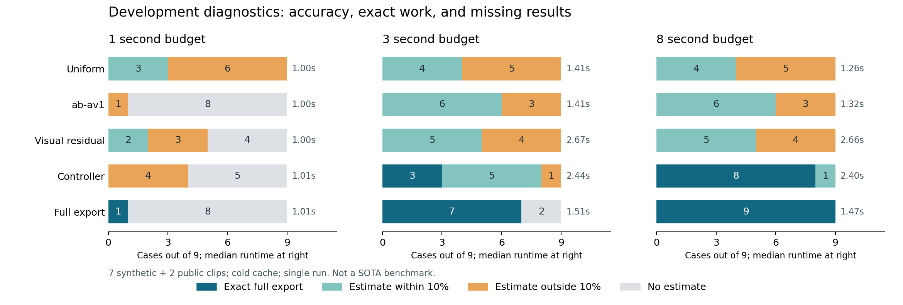

# 云端开发诊断，2026-10-02

**结论：三轴契约已经可运行，尚未达到 SOTA 或工业验收。** 实验支持继续发展预算感知调度；没有证明当前采样估计器优于成熟基线。低成本可靠区间仍缺独立校准数据。

环境：4 核 CPU 配额、16 GiB 内存、Linux、Python 3.12.14、FFmpeg 7.1.5、ab-av1 v0.11.7。源视频分别为 11–40 秒、约 384 像素宽；七个程序生成案例、两个公开视频来源。单次运行、冷缓存、x264 medium CRF 23、两个编码线程、MP4，无音频。完整视频与所有试编码用同一导出配置。

这些案例是开发诊断集，已经用于发现和修复问题；不能作为独立盲测结果。文件大小由实际完整编码取得，预测在参考文件生成前保存。执行中的控制器可以花费自己的预算完成编码，其结果明确计入“完整导出”列。

## 预测结果

“±10% 命中”以全部 9 个案例为分母，超时无输出计为失败；误差中位数/P90 只针对有输出的案例。完整编码产生的零误差不等于低成本预测突破。

| 预算 | 方法 | 有输出 | ±10% 命中 | APE 中位数 | APE P90 | 实际耗时中位数 | 完整导出 |
| --- | --- | --- | --- | --- | --- | --- | --- |
| 1 s | 均匀三段采样 | 9/9 | 3/9 | 57.19% | 94.83% | 1.004 s | 0 |
| 1 s | ab-av1 | 1/9 | 0/9 | 30.08% | 30.08% | 1.002 s | 0 |
| 1 s | 视觉残差采样 | 5/9 | 2/9 | 25.52% | 70.36% | 1.005 s | 0 |
| 1 s | 统一控制器 | 4/9 | 0/9 | 49.20% | 87.53% | 1.005 s | 0 |
| 1 s | 直接完整导出 | 1/9 | 1/9 | 0% | 0% | 1.008 s | 1 |
| 3 s | 均匀三段采样 | 9/9 | 4/9 | 32.95% | 100.76% | 1.406 s | 0 |
| 3 s | ab-av1 | 9/9 | 6/9 | 3.29% | 60.55% | 1.405 s | 0 |
| 3 s | 视觉残差采样 | 9/9 | 5/9 | 4.83% | 37.56% | 2.666 s | 0 |
| 3 s | 统一控制器 | 9/9 | 8/9 | 3.12% | 19.75% | 2.438 s | 3 |
| 3 s | 直接完整导出 | 7/9 | 7/9 | 0% | 0% | 1.506 s | 7 |
| 8 s | 均匀三段采样 | 9/9 | 4/9 | 32.95% | 100.76% | 1.264 s | 0 |
| 8 s | ab-av1 | 9/9 | 6/9 | 3.29% | 60.55% | 1.321 s | 0 |
| 8 s | 视觉残差采样 | 9/9 | 5/9 | 4.83% | 37.59% | 2.657 s | 0 |
| 8 s | 统一控制器 | 9/9 | 9/9 | 0% | 0.41% | 2.398 s | 8 |
| 8 s | 直接完整导出 | 9/9 | 9/9 | 0% | 0% | 1.469 s | 9 |

8 秒下直接完整导出更便宜且全精确；控制器仍有一例未校准估计，虽真实误差约 2.04%，运行时不能宣称其可靠性已经达标。1 秒预算下控制器表现很差，全片预处理和首批片段的成本仍需改进。

所有请求的点估计、误差、耗时、失败状态见 [evaluated.json](evaluated.json)；固定配置见 [metadata.json](metadata.json)；参考字节数及摘要见 [references.json](references.json)。源下载地址、摘要和生成参数见 [sources.json](sources.json)、[manifest.json](manifest.json)。

## 硬体积上限与质量诊断

冷缓存，每次最多六个新探测、四个 CRF 候选，CRF 不高于 35；上限设为相同素材 CRF 23 完整文件的指定比例。没有提供校准数据，因此成功结果必须是实际完整文件。

| 素材 | 上限比例 | 字节上限 | 8 秒预算 | 20 秒预算 | 20 秒成功文件 | 所选 CRF | PSNR / 原 CRF 23 PSNR |
| --- | --- | --- | --- | --- | --- | --- | --- |
| 运动 | 90% | 768483 | 未达标 | 达标 | 703209 | 25 | 41.02 / 42.88 dB |
| 运动 | 70% | 597709 | 达标 | 达标 | 577326 | 27 | 39.38 / 42.88 dB |
| 运动 | 50% | 426935 | 达标 | 达标 | 415247 | 31 | 36.63 / 42.88 dB |
| 行人 | 90% | 529143 | 达标 | 达标 | 513951 | 24 | 43.32 / 44.13 dB |
| 行人 | 70% | 411555 | 达标 | 达标 | 347521 | 27 | 41.13 / 44.13 dB |
| 行人 | 50% | 293968 | 未达标 | 达标 | 237808 | 30 | 38.97 / 44.13 dB |
| 持续噪声 | 90% | 5375630 | 未达标 | 未达标 | — | — | — |
| 持续噪声 | 70% | 4181046 | 未达标 | 达标 | 968866 | 27 | 31.46 / 33.23 dB |
| 持续噪声 | 50% | 2986461 | 未达标 | 未达标 | — | — | — |

8 秒下完成 4/9，20 秒下完成 7/9；合计 11 个成功文件全部实测不超限。其余 7 个请求没有发布文件。这个小样本中的零超限不能替代大规模故障验收；“未达标”表示本次搜索没有满足请求，不证明不可行。时间、试编码次数和候选数都是独立的资源限制，剩余时间不等于尚有可执行的新探测。

持续噪声 70% 上限的结果只用了约 23% 的字节预算，说明当前 CRF 提议可能过度降低质量，尚未优化到最佳可行配置。PSNR 仅用于展示像素质量变化，不提供感知质量保证。FFmpeg 7.1.5 的 XPSNR 在该低分辨率素材上发生 SIGFPE，质量诊断改用 PSNR；原有控制结果在质量测量前已经保存，未重写控制结果。

原始记录：[8 秒](size-control-8s.json)、[20 秒](size-control-20s.json)。预算、代码摘要和冷缓存声明见相应 `size-control-*-metadata.json`。

## 已执行的验证

- 16 项测试通过，包含实际 FFmpeg 编解码、AAC 音频、尺寸滤镜、字节上限、损坏缓存、停止正在执行的编码、禁止发布未达标文件、跨工具链校准隔离和逐次风险分配。
- Python 包已在隔离虚拟环境中安装；CLI 导出另行核对事件、返回码、实际文件大小和完整解码。
- Ruff 检查与格式检查通过。GitHub Actions 已配置，但尚未在远端执行。
- LaTeX 文献内容已修订；本机缺少 `ctexart.cls`，未成功生成综述 PDF。

## 实验发现与修正

首轮控制器在 3 秒下命中 5/9，8 秒下命中 8/9。原因之一是把进程启动和产物检查的固定开销按全片长度外推，导致错过便宜的完整导出。将 FFmpeg 内部转码时间与固定开销分开后，得到上表结果。两轮的全部完整参考文件字节数和 SHA-256 相同。

另一个问题尚未解决：2 秒片段会重置 GOP。行人样本为 10 fps，2 秒试编码有 20 帧，其中第一帧是较大的关键帧；连续 40 秒编码只包含两个关键帧。2 秒窗口直接外推产生约 66% payload 偏差，增加到 16 秒后该偏差约降为 4.7%，但计算成本也随之增加。视觉残差采样在此例的完整文件误差仍为 62.32%。随机抽样修正不能消除编码上下文的系统偏差。

体积控制的后续实验发现，切换 CRF 后再次试编码可能用尽探测预算，即使已知完整编码成本。后续修正复用同素材的完整编码耗时，并允许代表片段的超限估计引导下一候选；最终可行性仍由完整文件确认。该修正只作用于设置了大小上限的请求。预测实验所用源码摘要与后续体积实验所用摘要分别保存；原始代码快照在本地相应 `artifacts/*/code` 中。

## 仍需要解决的问题

- 低预算首次结果，以及短片段与连续编码的上下文偏差。
- 独立来源的开发/校准/盲测数据。当前没有实际可交付的校准模型，可靠性旋钮尚不能提供经过业务数据验证的连续精度—成本曲线。
- 较长和高分辨率视频、VFR、复杂音轨、真实编辑流程，以及资源峰值/并发/崩溃恢复验收。
- 感知质量和最优可行配置。限制 CRF、找到合规文件以及 PSNR 诊断都不等于证明最佳感知质量。

这些限制是实验结果的一部分，不能通过删掉失败案例或改写成功率分母来消除。
