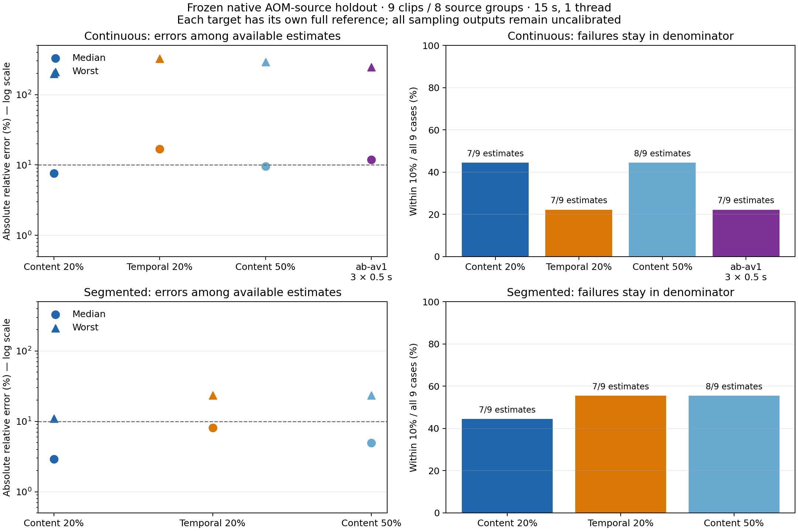

# Frozen industrial-related holdout

Nine public AOM CTC sources, eight conservative source groups; native dimensions, original frame rate and all 130 frames. This is a CTC-source subset, not official CTC codec testing, SOTA certification, or broad industrial generalization.

Continuous and segmented predictions are scored against their own actual export targets. Every prediction was persisted before completed reference labels were generated/read. No holdout scores were used to adjust the frozen implementation.

Request time excludes explicitly reported immutable-upload preparation. Each prediction has its own cold result cache. Structural success alone is not prediction accuracy.

| Target | Wall budget | Encode fraction | Estimates/cases | Within 10% of all cases | Median APE | Worst APE | Median wall |
| --- | ---: | ---: | ---: | ---: | ---: | ---: | ---: |
| continuous | 15s | 20% | 7/9 | 44% | 7.66% | 198.79% | 2.62s |
| continuous | 15s | 50% | 8/9 | 44% | 9.63% | 292.29% | 11.05s |
| segmented | 15s | 20% | 7/9 | 44% | 2.90% | 10.98% | 3.11s |
| segmented | 15s | 50% | 8/9 | 56% | 4.93% | 23.54% | 15.01s |

Failed/no-estimate cases remain in the denominator. Missing completed references are reported separately. Without an independent calibration profile, sampling estimates retain `uncalibrated` evidence; this benchmark does not invent coverage certificates.

Full reference targets: 18/18. Full-decode checks are recorded per reference.

See `metadata.json`, `predictions.jsonl`, `predictions.complete.json`, `references.json`, `evaluated.json`, `summary.json`, and per-request `answers/` for the complete evidence.

## Preregistered same-target baseline

The temporal policy was preregistered before any completed reference labels were generated/read. The runner was interrupted before the reference phase, preserving 36 content predictions and 7 completed official predictions; 18 fresh temporal predictions and the remaining 2 official predictions were then persisted before the joint completion barrier. See `preregistration-temporal-baseline.json` and both runner snapshots. The source policy hash never changed.

| Target | Content median / worst APE | Temporal median / worst APE | Within 10%, content / temporal | Outputs, each |
| --- | ---: | ---: | ---: | ---: |
| continuous | 7.66% / 198.79% | 16.86% / 325.44% | 4/9 / 2/9 | 7/9 |
| segmented | 2.90% / 10.98% | 8.09% / 23.32% | 4/9 / 5/9 | 7/9 |

This comparison uses the same 15-second budget, 20% requested video-time cap, native dimensions, CRF23, medium preset, and one thread. Content sampling improves the median but does not win every accuracy measure; segmented within-10% success is 4/9 versus temporal 5/9. Increased budget also did not monotonically improve error in this cohort. No sampling output was presented as certified.

## Official external baseline

ab-av1 0.11.7 produced 7/9 native estimates under 15 seconds with three 500 ms samples: median APE 11.86%, worst 246.62%, within 10% in 2/9 cases. It has no encode-fraction cap, and its unmodified official estimate is scored only against continuous full-file bytes. It is not a same-target segmented ranking. See `baseline-evaluated.json`.

## Distinct export target and limits

At the same CRF23, the explicit 0.5-second segmented target changes file size by a median 4.57% and as much as 236.84% versus continuous. A subsequent [native quality analysis](../quality/README.md) measured median PSNR change of −0.138 dB and SSIM change of −0.000609 against the same original source. Two screen cases exceed +200% file growth while losing more than 2.5 dB PSNR. These measurements use the sealed references after prediction scoring; they do not retune the frozen estimator. No VMAF or equal-size quality ranking was available. Lower encoder-state bias must not be presented as a free improvement to the unchanged continuous export.

`encoded_video_fraction` in the saved tables is the Engine charge of requested output-video seconds. Segmented charges use exact integer frame counts; continuous half-second windows can round to whole frames. This metric is not an independent measurement of executed CPU frame work. Wall time is measured, and the 20%/50% requested-time caps had zero violations. The two shortest 60-fps sources cannot fit a first full 0.5-second unit in their 20% quota and therefore return no estimate.

All 18 references passed full decoding, original 130-frame count, dimensions and frame-rate checks. Every segmented reference also passed the exact compressed-payload/container byte identity. These structural guarantees do not certify the accuracy or confidence of an incomplete sample.

The markers show measured median and worst errors, not confidence intervals. Missing estimates remain in the all-case denominator. No general industrial or SOTA claim is supported by this small cohort.
